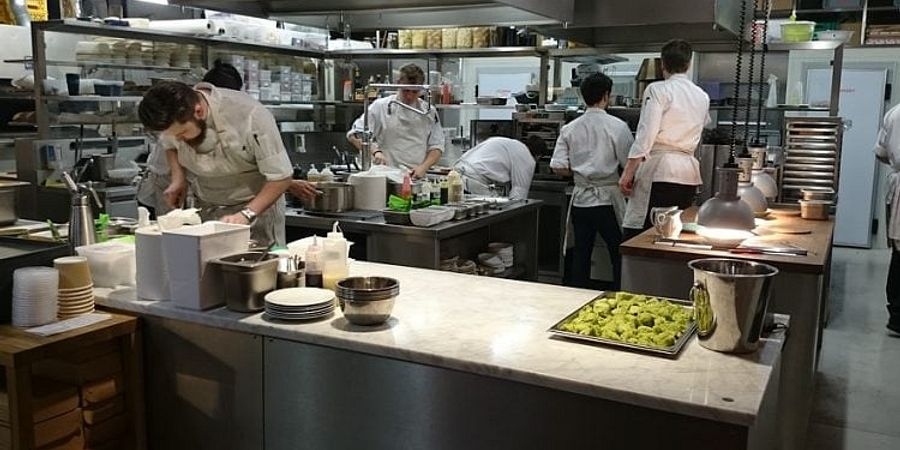

## Interpreter vs Compiler

### Interpreter vs Compiler izahi üçün restoran mətbəxi ilə izah edəcəm.

* İlk olaraq Compiler.
- Compiler mətbəx (Bir restoran mətbəxi düşünün. 1 baş aşbaz(əmir verən) var, 4 aşbaz - desert aşbazı,isti yemək aşbazı və s. və onlarin altinda onlarin tələbələri və köməkçiləri(umumi - yazılan praqram) var.)
    - (Vaxt istifadəsi) Hər gün səhər tezdən baş aşbaz(əmir verən) hər kəsə bir-bir tapşırığını veririr > desert aşpazına,tələbələrə,köməkçilərə və s. tapşırığı verən şəxsin hər şeyi bir-bir yoxladığını və təlimat verdiyini düşünün . Təbii ki, bu çox vaxt alasıdı. Ancaq mətbəxə sfariş gəldiyi  müddətdən etibarı ilə işlər çox sürətli davam edəcək.İstənilən sfarişdə  bir-birini ardınca gözləmə və təkrar olmadan davam edə biləcək.
    - (Anlaşılırlıq) Compiler mətbəxdə kənardan baxanda bir şey anlamaq çətdir. Çünki orda hər şey aşbazlarin anlamlandıra biləcəyi bir mətiqdə qurulub icra edilir.
    - (Eyni Axtekturada işləmə) Compiler mətbəxdəki baş aşbaz(əmir verən) işlədiyi mətbəx növü İtaliyadırsa yəni italiyan yeməkləri bişirisə deməli ancaq İtalyan mətbəxini anlayan aşbazlarla işləyə bilər. 
    - (Fərqli platformalarda işləməsi üçün fix etmə) Biz əgər mətbəximizin yəni aşbazlarimizin başqa mətbəx növündən, məs.Yapon mətbəxdən yemək bişirəsini istəyiriksə birinci olaraq baş aşbaz(əmir verənə) Yapon mətbəx öyrədilməlidi, ikinci olaraq Yapon mətbəxini analayan aşbazlari dəstəyə əlavə etmək lazimdir.
    - (Yaddaşda yer tutma məsələsi) Compiler mətbəxdə yer qismində bizə kömək etməyəcək - səbəb çünki, fərqli aşbazlar işlərkən onlara lazim olan qarniturlar hər aşbazin ayri-ayri stolunda olmasi lazimdi. Buna görə işləm yeri cəhətdən bizə geniş ərazi lazimdır.

    